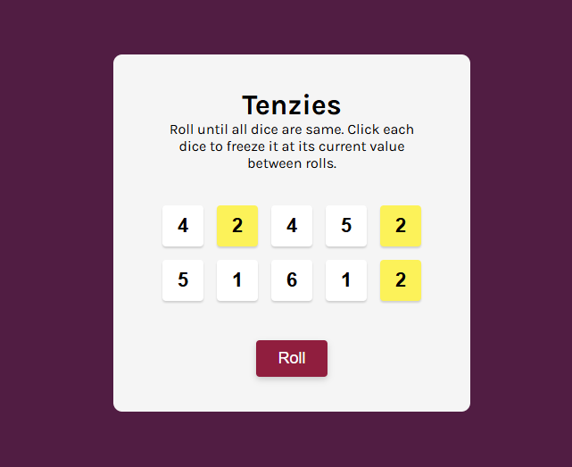

# 🎲 Tenzies Game (React)

A fun and interactive dice game built with React as part of Scrimba's React course. Roll the dice, hold the ones you want, and try to get all dice to show the same number — as fast as possible!

## 🧠 About the Game

Tenzies is a classic dice game where the objective is to roll ten dice until all of them show the same number. You can "hold" any dice you want between rolls to keep their values.

This project was created to reinforce my knowledge of:

- React state management
- Logic Thinking
- Conditional rendering
- Event handling
- React hooks like `useState`, `useEffect` and `useRef`

## 🚀 Features

- Roll 10 dice with random values
- Click to “hold” dice between rolls
- Win detection logic: all dice held and show the same number
- Confetti effect on win 🎉
- Focus to the New Game button on win

## 📸 Preview



## 🛠️ Technologies Used

- Vite
- React
- JavaScript (ES6+)
- CSS

## 🧑‍💻 Getting Started

To run the project locally:

1. Clone the repository:
   ```
   git clone https://github.com/TheDesignerKhawaja/tenzies-game.git
   ```
2. Navigate to the project folder:
   ```
   cd tenzies-game
   ```
3. Install dependencies:
   ```
   npm install
   ```
4. Start the development server:
   ```
   npm run dev
   ```

## 🎮 Play Online

Check out the live version: [tenzies-game-haider.netlify.app](https://tenzies-game-haider.netlify.app)


## 🙋‍♂️ Author

**Khawaja Haider**

- 💼 [LinkedIn](https://www.linkedin.com/in/khawajahaider/)

## 📄 License

This project is licensed under the [MIT License](LICENSE).
